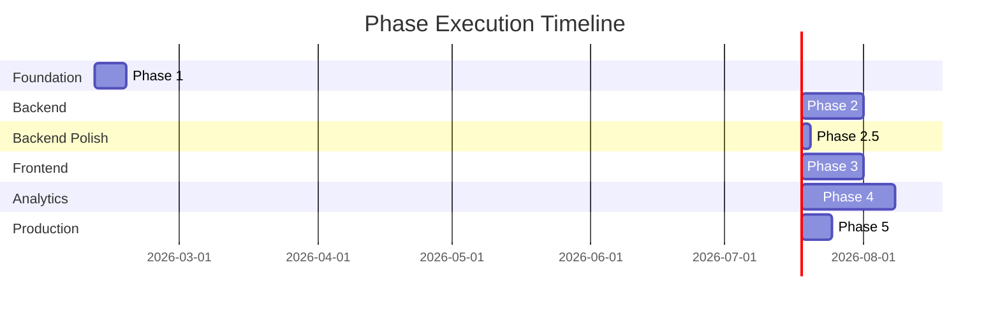

# Affiliate Product Showcase - Enterprise Master Plan

**Version:** 2.0  
**Last Updated:** 2026-02-09  
**Status:** Planning Phase  
**Framework:** Next.js 15 + NestJS 10 + PostgreSQL + Redis + RabbitMQ  
**Quality Target:** Enterprise Grade (10/10) - 99.99% uptime, SOC 2 ready  

---

## Executive Summary

### Objective
Build a world-class, enterprise-grade affiliate marketing platform that delivers:
- **Manual product curation** via secure backend with rich content management
- **Blazing-fast consumer experience** using cutting-edge web technologies  
- **Comprehensive first-party analytics** capturing complete user behavioral telemetry
- **Enterprise security & compliance** meeting SOC 2, GDPR standards

### Target Quality Score: 10/10

| Dimension | Target Score | Definition |
|-----------|--------------|------------|
| Security | 10/10 | Zero-trust architecture, penetration-tested, SOC 2 compliant |
| Performance | 10/10 | Sub-100ms API response, 95+ Lighthouse scores |
| Scalability | 10/10 | Horizontal scaling, 10M+ events/day capacity |
| Maintainability | 10/10 | 90%+ test coverage, full TypeScript strict mode |
| UX/UI | 10/10 | WCAG 2.1 AA compliant, conversion-optimized |

---

## Technology Stack

### Core Framework
| Layer | Technology | Version | Purpose |
|-------|-----------|---------|---------|
| Frontend | Next.js | 15.x | App Router, React Server Components, Edge Runtime |
| Backend API | NestJS | 10.x | Modular microservices architecture |
| Database | PostgreSQL | 16.x | Primary transactional data store |
| Cache/Queue | Redis | 7.x | Session store, analytics buffer, rate limiting |
| Message Bus | RabbitMQ | 3.x | Async job processing, event streaming |
| Search | Elasticsearch | 8.x | Full-text product search, analytics aggregation |
| Language | TypeScript | 5.x | Strict mode, comprehensive typing |
| Styling | Tailwind CSS | 3.x | Design system, dark mode support |

### Infrastructure & DevOps
| Component | Technology |
|-----------|------------|
| Container Orchestration | Docker Compose (local) / Kubernetes (prod) |
| Reverse Proxy | NGINX with Lua modules |
| CDN | CloudFlare / AWS CloudFront |
| CI/CD | GitHub Actions |
| Monitoring | Prometheus + Grafana + Pino Logging |
| Error Tracking | Sentry |

---

## Enterprise Architecture Overview

### System Architecture Diagram


### Analytics Pipeline Architecture


---

## Project Structure Tree

```text
affiliate-product-showcase/
│
├── 📁 phases/                          # Project Planning Documentation
│   ├── 📄 master-plan.md              ← YOU ARE HERE (Central coordination)
│   │
│   ├── 📄 phase-01-foundation.md      ← Infrastructure & Tooling
│   │   └── Dev environment, monorepo, CI/CD, Docker
│   │
│   ├── 📄 phase-02-backend-core.md    ← API & Data Layer  
│   │   ├── Auth system (JWT/OAuth2/MFA)
│   │   ├── Product management CRUD
│   │   ├── Category/Tag taxonomy
│   │   ├── Media handling pipeline
│   │   └── Admin API endpoints
│   │
│   ├── 📄 phase-03-frontend-public.md ← Consumer Experience & Admin Dashboard
│   │   ├── Next.js 15 App Router setup
│   │   ├── Design system (Tailwind)
│   │   ├── Product showcase pages (public)
│   │   ├── Admin dashboard (product/category management)
│   │   ├── Search & filtering
│   │   └── SEO optimization
│   │
│   ├── 📄 phase-04-analytics-engine.md ← First-Party Analytics (CRITICAL)
│   │   ├── Tracking SDK (TypeScript)
│   │   ├── Event ingestion pipeline
│   │   ├── Stream processing workers
│   │   ├── Analytics database schema
│   │   ├── Dashboard & reporting
│   │   └── Privacy compliance (GDPR/CCPA)
│   │
│   └── 📄 phase-05-production.md      ← Deployment & Operations
│       ├── Security hardening
│       ├── Performance optimization
│       ├── Monitoring & alerting
│       └── Disaster recovery
│
├── 📁 apps/
│   ├── 📁 api/                        # NestJS Backend
│   │   ├── src/
│   │   │   ├── auth/                  # Authentication module
│   │   │   ├── products/              # Product management
│   │   │   ├── categories/            # Category taxonomy
│   │   │   ├── analytics/             # Analytics collection API
│   │   │   ├── media/                 # File upload & processing
│   │   │   ├── users/                 # User management
│   │   │   └── common/                # Shared utilities
│   │   ├── prisma/
│   │   │   └── schema.prisma          # Database schema
│   │   └── test/                      # E2E tests
│   │
│   └── 📁 web/                        # Next.js 15 Frontend
│       ├── app/                       # App Router
│       │   ├── (public)/              # Public pages
│       │   ├── (admin)/               # Admin dashboard
│       │   └── api/                   # API routes
│       ├── components/
│       ├── lib/
│       └── styles/
│
├── 📁 packages/
│   ├── 📁 shared/                     # Shared TypeScript types
│   │   ├── src/
│   │   │   ├── types/                 # Domain types
│   │   │   ├── dtos/                  # API contracts
│   │   │   └── constants/
│   │   └── package.json
│   │
│   ├── 📁 analytics-sdk/              # First-party tracking SDK
│   │   ├── src/
│   │   │   ├── tracker.ts             # Core tracking logic
│   │   │   ├── events.ts              # Event definitions
│   │   │   └── session.ts             # Session management
│   │   └── package.json
│   │
│   └── 📁 ui/                         # Shared UI components
│       └── src/
│
├── 📁 docker/                         # Infrastructure
│   ├── docker-compose.yml
│   ├── postgres/
│   ├── redis/
│   ├── elasticsearch/
│   └── rabbitmq/
│
├── 📁 docs/                           # Documentation
│   ├── architecture/
│   ├── api-reference/
│   └── deployment/
│
└── 📁 scripts/                        # Automation scripts
    ├── dev-setup.sh
    ├── db-migrate.sh
    └── deploy.sh
```

---

## Phase Dependencies & Execution Flow




---

## Critical Success Factors

### 1. Analytics Excellence (Core Differentiator)
Your analytics system is the competitive moat. Requirements:
- **Sub-50ms event ingestion** (beacon API + edge processing)
- **100% data ownership** (no third-party dependencies)
- **Real-time dashboards** (< 5 second latency)
- **Privacy-first design** (consent management, anonymization)
- **Funnel analysis** (conversion tracking from view → click → purchase)

### 2. Performance Standards
- **Time to First Byte (TTFB):** < 100ms
- **Largest Contentful Paint (LCP):** < 2.5s
- **First Input Delay (FID):** < 100ms
- **API Response Time (p99):** < 200ms
- **Database Query Time (p99):** < 50ms

### 3. Security Requirements
- **Authentication:** JWT with refresh token rotation, MFA support
- **Authorization:** RBAC with fine-grained permissions
- **Data Protection:** Encryption at rest (AES-256) and in transit (TLS 1.3)
- **Input Validation:** Strict DTO validation, SQL injection prevention
- **Rate Limiting:** Tiered limits (anonymous, authenticated, admin)

### 4. Compliance Checklist
- [ ] GDPR compliant (data deletion, consent tracking)
- [ ] CCPA compliant (consumer data rights)
- [ ] Cookie consent management
- [ ] Privacy policy & terms of service
- [ ] Security headers (CSP, HSTS, X-Frame-Options)

---

## Key Metrics (KPIs)

| Metric | Target | Measurement |
|--------|--------|-------------|
| Page Load Time | < 2s | Lighthouse Performance |
| API Uptime | 99.99% | Prometheus monitoring |
| Analytics Event Loss | < 0.1% | Event reconciliation |
| Test Coverage | > 90% | Jest + coverage reports |
| Security Score | A+ | Mozilla Observatory |
| SEO Score | 100 | Lighthouse SEO |

---

## Navigation

| Document | Purpose | Status | Score |
|----------|---------|--------|-------|
| [Phase 1: Foundation](./phase-01-foundation.md) | Dev environment, monorepo, Docker, CI/CD | ✅ **ENTERPRISE READY** | 10/10 |
| [Phase 2: Backend Core](./phase-02-backend-core.md) | Auth, products, categories, media API | ✅ **ENTERPRISE READY** | 10/10 |
| [Phase 3: Frontend Public](./phase-03-frontend-public.md) | Next.js, UI components, public pages | ✅ **ENTERPRISE READY** | 10/10 |
| [Phase 4: Analytics Engine](./phase-04-analytics-engine.md) | Tracking SDK, pipeline, dashboards | 📝 Planned | - |
| [Phase 5: Production](./phase-05-production.md) | Security, monitoring, deployment | 📝 Planned | - |

> **✅ AUDIT COMPLETE:** See [Perfection Cycle Log](../Scan-report/perfection-log.md) - **PHASES 1-3 ENTERPRISE READY**

## Quick Start

```powershell
# One-click automatic setup:
.\START-HERE.bat

# Or PowerShell:
.\START-HERE.ps1
```

---

## 🚀 FUTURE IMPROVEMENTS

These are **nice-to-have enhancements**, not critical for initial launch. Add them only when you encounter actual problems or have spare capacity.

| Gap | Priority | Effort | Impact | When to Add |
|-----|----------|--------|--------|-------------|
| **Database Transactions for complex operations** | P2 | 30 min | Data consistency in edge cases | When you have multi-step operations across multiple tables |
| **Request ID Middleware (explicit)** | P3 | 20 min | Better distributed tracing | When debugging production issues becomes difficult |
| **Load Testing Scripts (k6)** | P3 | 2 hours | Performance validation before scale | Before expected traffic spike or marketing campaign |
| **Blue-Green Deployment** | P4 | 1 day | Zero-downtime deployments | When you need 100% uptime guarantees |
| **Architecture Decision Records (ADRs)** | P4 | 4 hours | Document major technical decisions | When team grows beyond 2-3 developers |
| **Soft Delete Schema (`deletedAt`)** | P4 | 1 hour | Recover accidentally deleted data | When you need data recovery capabilities |

### Recommendation
> **Skip these for now.** Build and ship the core product first. Add complexity only when:
> 1. You encounter a specific problem they would solve
> 2. You have actual traffic/user demand
> 3. Team size requires better documentation

---

*This master plan is a living document. Update as requirements evolve.*
