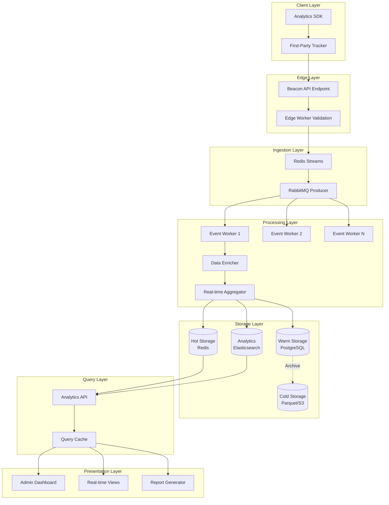

# Phase 4: Advanced Analytics Engine (Core Requirement)

**Objective:** Build a proprietary, enterprise-grade analytics suite that captures complete user behavioral telemetry, processes high-throughput events in real-time, and provides actionable insights through intuitive dashboards. This is your competitive moat.

**Framework:** Next.js 15 + NestJS 10 + PostgreSQL + Redis + RabbitMQ  
**Estimated Duration:** 21 days  
**Prerequisites:** Phases 1-3 completed, RabbitMQ & Redis operational

**Quality Target:** Enterprise Grade (10/10) - 10M+ events/day, real-time, GDPR-compliant

---

## 1. Analytics Architecture Overview

### 1.1 Data Flow Diagram



### 1.2 Event Types Specification

```typescript
// packages/analytics-sdk/src/events.ts

export enum EventType {
  // Page & Navigation
  PAGE_VIEW = 'page_view',
  PAGE_EXIT = 'page_exit',
  SCROLL_DEPTH = 'scroll_depth',
  
  // Product Engagement
  PRODUCT_VIEW = 'product_view',
  PRODUCT_HOVER = 'product_hover',
  PRODUCT_CLICK = 'product_click',
  PRODUCT_COMPARE = 'product_compare',
  PRODUCT_WISHLIST = 'product_wishlist',
  
  // Conversion Events
  AFFILIATE_CLICK = 'affiliate_click',
  AFFILIATE_HOVER = 'affiliate_hover',
  COPIED_COUPON = 'copied_coupon',
  SHARED_PRODUCT = 'shared_product',
  
  // Search Events
  SEARCH_QUERY = 'search_query',
  SEARCH_FILTER = 'search_filter',
  SEARCH_SORT = 'search_sort',
  ZERO_RESULTS = 'zero_results',
  
  // User Interaction
  CLICK = 'click',
  HOVER = 'hover',
  FOCUS = 'focus',
  BLUR = 'blur',
  FORM_START = 'form_start',
  FORM_SUBMIT = 'form_submit',
  FORM_ABANDON = 'form_abandon',
  
  // Session Events
  SESSION_START = 'session_start',
  SESSION_END = 'session_end',
  HEARTBEAT = 'heartbeat',
  IDLE_START = 'idle_start',
  IDLE_END = 'idle_end',
  
  // Error Events
  JS_ERROR = 'js_error',
  API_ERROR = 'api_error',
  SLOW_PAGE = 'slow_page',
}

export interface BaseEvent {
  // Core Identifiers
  eventId: string;
  eventType: EventType;
  timestamp: number;
  
  // Session Context
  sessionId: string;
  visitorId: string;
  
  // Page Context
  pageUrl: string;
  pagePath: string;
  pageTitle: string;
  referrer: string;
  
  // Device Context
  userAgent: string;
  screenResolution: string;
  viewport: string;
  deviceType: 'desktop' | 'tablet' | 'mobile';
  os: string;
  browser: string;
  browserVersion: string;
  
  // Geo (populated server-side)
  country?: string;
  region?: string;
  city?: string;
  
  // UTM Parameters
  utmSource?: string;
  utmMedium?: string;
  utmCampaign?: string;
  utmTerm?: string;
  utmContent?: string;
  
  // Custom Properties
  properties: Record<string, unknown>;
}

export interface PageViewEvent extends BaseEvent {
  eventType: EventType.PAGE_VIEW;
  properties: {
    loadTime: number;
    ttfb: number;
    fcp: number;
    lcp: number;
    fid: number;
    cls: number;
  };
}

export interface ProductViewEvent extends BaseEvent {
  eventType: EventType.PRODUCT_VIEW;
  properties: {
    productId: string;
    productName: string;
    productSlug: string;
    productPrice: number;
    categoryId?: string;
    categoryName?: string;
    source: 'direct' | 'search' | 'category' | 'recommendation' | 'related';
    timeOnPage?: number;
  };
}

export interface AffiliateClickEvent extends BaseEvent {
  eventType: EventType.AFFILIATE_CLICK;
  properties: {
    productId: string;
    productName: string;
    linkId: string;
    platform: string;
    price: number;
    position: 'hero' | 'sidebar' | 'inline' | 'sticky';
    ctaText: string;
  };
}

export interface ScrollDepthEvent extends BaseEvent {
  eventType: EventType.SCROLL_DEPTH;
  properties: {
    depth: number; // 0-100 percentage
    maxDepth: number;
    pixelDepth: number;
    contentHeight: number;
  };
}

export type AnalyticsEvent = 
  | PageViewEvent 
  | ProductViewEvent 
  | AffiliateClickEvent 
  | ScrollDepthEvent
  | BaseEvent;
```

---

## 2. First-Party Analytics SDK

### 2.1 Core Tracker Implementation
```typescript
// packages/analytics-sdk/src/tracker.ts

import { EventType, BaseEvent, AnalyticsEvent } from './events';
import { SessionManager } from './session';
import { DeviceDetector } from './device';
import { UtmParser } from './utm';
import { PerformanceMonitor } from './performance';

interface TrackerConfig {
  endpoint: string;
  apiKey?: string;
  debug?: boolean;
  batchSize?: number;
  flushInterval?: number;
  sampleRate?: number;
  respectDnt?: boolean;
}

interface ConsentState {
  analytics: boolean;
  marketing: boolean;
  necessary: boolean;
}

export class AnalyticsTracker {
  private config: Required<TrackerConfig>;
  private sessionManager: SessionManager;
  private deviceDetector: DeviceDetector;
  private utmParser: UtmParser;
  private performanceMonitor: PerformanceMonitor;
  private eventQueue: AnalyticsEvent[] = [];
  private flushTimer: ReturnType<typeof setInterval> | null = null;
  private consent: ConsentState = { analytics: true, marketing: false, necessary: true };
  private isInitialized = false;

  constructor(config: TrackerConfig) {
    this.config = {
      endpoint: config.endpoint,
      apiKey: config.apiKey || '',
      debug: config.debug || false,
      batchSize: config.batchSize || 10,
      flushInterval: config.flushInterval || 5000,
      sampleRate: config.sampleRate || 1,
      respectDnt: config.respectDnt !== false,
    };

    this.sessionManager = new SessionManager();
    this.deviceDetector = new DeviceDetector();
    this.utmParser = new UtmParser();
    this.performanceMonitor = new PerformanceMonitor();
  }

  init(): void {
    if (this.isInitialized) return;
    if (this.shouldNotTrack()) return;

    this.isInitialized = true;
    this.sessionManager.init();
    
    this.setupAutoTracking();
    this.startFlushTimer();
    this.track(EventType.SESSION_START);
    
    this.log('Analytics initialized', {
      sessionId: this.sessionManager.getSessionId(),
      visitorId: this.sessionManager.getVisitorId(),
    });
  }

  // Core tracking method
  track(eventType: EventType, properties: Record<string, unknown> = {}): void {
    if (!this.isInitialized || !this.consent.analytics) return;
    if (Math.random() > this.config.sampleRate) return;

    const event = this.createEvent(eventType, properties);
    this.eventQueue.push(event);

    if (this.eventQueue.length >= this.config.batchSize) {
      this.flush();
    }
  }

  // Page view tracking
  trackPageView(additionalProps: Record<string, unknown> = {}): void {
    const performance = this.performanceMonitor.getMetrics();
    
    this.track(EventType.PAGE_VIEW, {
      ...performance,
      ...additionalProps,
    });

    // Reset scroll tracking for new page
    this.setupScrollTracking();
  }

  // Product-specific tracking
  trackProductView(product: {
    id: string;
    name: string;
    slug: string;
    price: number;
    categoryId?: string;
    categoryName?: string;
  }, source: string): void {
    this.track(EventType.PRODUCT_VIEW, {
      productId: product.id,
      productName: product.name,
      productSlug: product.slug,
      productPrice: product.price,
      categoryId: product.categoryId,
      categoryName: product.categoryName,
      source,
    });
  }

  // Affiliate link tracking
  trackAffiliateClick(product: {
    id: string;
    name: string;
  }, link: {
    id: string;
    platform: string;
    price: number;
  }, position: string, ctaText: string): void {
    this.track(EventType.AFFILIATE_CLICK, {
      productId: product.id,
      productName: product.name,
      linkId: link.id,
      platform: link.platform,
      price: link.price,
      position,
      ctaText,
    });
  }

  // Flush events to server
  async flush(): Promise<void> {
    if (this.eventQueue.length === 0) return;

    const events = [...this.eventQueue];
    this.eventQueue = [];

    const payload = {
      events,
      metadata: {
        sentAt: Date.now(),
        sdkVersion: '1.0.0',
      },
    };

    try {
      // Use Beacon API if available for unload, otherwise fetch
      if (navigator.sendBeacon) {
        const blob = new Blob([JSON.stringify(payload)], { type: 'application/json' });
        const sent = navigator.sendBeacon(this.config.endpoint, blob);
        if (!sent) throw new Error('Beacon failed');
      } else {
        await fetch(this.config.endpoint, {
          method: 'POST',
          headers: {
            'Content-Type': 'application/json',
          },
          body: JSON.stringify(payload),
          keepalive: true,
        });
      }

      this.log('Events flushed', { count: events.length });
    } catch (error) {
      // Re-queue failed events
      this.eventQueue.unshift(...events);
      this.error('Failed to flush events', error);
    }
  }

  // Set consent state
  setConsent(consent: Partial<ConsentState>): void {
    this.consent = { ...this.consent, ...consent };
    this.log('Consent updated', this.consent);
  }

  // Destroy tracker
  destroy(): void {
    if (this.flushTimer) {
      clearInterval(this.flushTimer);
    }
    this.track(EventType.SESSION_END);
    this.flush();
    this.isInitialized = false;
  }

  private createEvent(eventType: EventType, properties: Record<string, unknown>): AnalyticsEvent {
    const device = this.deviceDetector.detect();
    const utm = this.utmParser.parse();

    return {
      eventId: this.generateId(),
      eventType,
      timestamp: Date.now(),
      sessionId: this.sessionManager.getSessionId(),
      visitorId: this.sessionManager.getVisitorId(),
      pageUrl: window.location.href,
      pagePath: window.location.pathname,
      pageTitle: document.title,
      referrer: document.referrer,
      userAgent: navigator.userAgent,
      screenResolution: `${window.screen.width}x${window.screen.height}`,
      viewport: `${window.innerWidth}x${window.innerHeight}`,
      deviceType: device.type,
      os: device.os,
      browser: device.browser,
      browserVersion: device.version,
      ...utm,
      properties,
    } as AnalyticsEvent;
  }

  private setupAutoTracking(): void {
    // Page visibility changes
    document.addEventListener('visibilitychange', () => {
      if (document.visibilityState === 'hidden') {
        this.flush();
      }
    });

    // Before unload
    window.addEventListener('beforeunload', () => {
      this.track(EventType.PAGE_EXIT);
      this.flush();
    });

    // Click tracking for conversion elements
    document.addEventListener('click', (e) => {
      const target = e.target as HTMLElement;
      const trackable = target.closest('[data-track]');
      
      if (trackable) {
        const eventType = trackable.getAttribute('data-track') as EventType;
        const props = this.parseDataAttributes(trackable, 'data-track-');
        this.track(eventType, props);
      }
    });

    // Heartbeat
    setInterval(() => {
      this.track(EventType.HEARTBEAT);
    }, 30000);
  }

  private setupScrollTracking(): void {
    let maxScroll = 0;
    const contentHeight = document.documentElement.scrollHeight - window.innerHeight;

    const trackScroll = () => {
      const currentScroll = window.scrollY;
      const depth = Math.round((currentScroll / contentHeight) * 100);
      
      if (depth > maxScroll) {
        maxScroll = depth;
        
        // Track at 25%, 50%, 75%, 90%, 100%
        const milestones = [25, 50, 75, 90, 100];
        milestones.forEach(milestone => {
          if (depth >= milestone && maxScroll < milestone + 5) {
            this.track(EventType.SCROLL_DEPTH, {
              depth: milestone,
              maxDepth: maxScroll,
              pixelDepth: currentScroll,
              contentHeight,
            });
          }
        });
      }
    };

    window.addEventListener('scroll', this.throttle(trackScroll, 250), { passive: true });
  }

  private startFlushTimer(): void {
    this.flushTimer = setInterval(() => {
      this.flush();
    }, this.config.flushInterval);
  }

  private shouldNotTrack(): boolean {
    // Respect Do Not Track
    if (this.config.respectDnt && navigator.doNotTrack === '1') {
      return true;
    }
    // Localhost in production
    if (process.env.NODE_ENV === 'production' && window.location.hostname === 'localhost') {
      return true;
    }
    return false;
  }

  private generateId(): string {
    return `${Date.now().toString(36)}-${Math.random().toString(36).substr(2, 9)}`;
  }

  private throttle<T extends (...args: unknown[]) => unknown>(fn: T, wait: number): (...args: Parameters<T>) => void {
    let lastTime = 0;
    return (...args: Parameters<T>) => {
      const now = Date.now();
      if (now - lastTime >= wait) {
        lastTime = now;
        fn(...args);
      }
    };
  }

  private parseDataAttributes(element: Element, prefix: string): Record<string, string> {
    const props: Record<string, string> = {};
    Array.from(element.attributes).forEach(attr => {
      if (attr.name.startsWith(prefix)) {
        const key = attr.name.slice(prefix.length).replace(/-([a-z])/g, (_, letter) => letter.toUpperCase());
        props[key] = attr.value;
      }
    });
    return props;
  }

  private log(...args: unknown[]): void {
    if (this.config.debug) {
      console.log('[Analytics]', ...args);
    }
  }

  private error(...args: unknown[]): void {
    if (this.config.debug) {
      console.error('[Analytics]', ...args);
    }
  }
}

// Singleton instance
let globalTracker: AnalyticsTracker | null = null;

export function initAnalytics(config: TrackerConfig): AnalyticsTracker {
  if (!globalTracker) {
    globalTracker = new AnalyticsTracker(config);
    globalTracker.init();
  }
  return globalTracker;
}

export function getTracker(): AnalyticsTracker | null {
  return globalTracker;
}
```

### 2.2 React Hook
```typescript
// packages/analytics-sdk/src/react.tsx
'use client';

import { createContext, useContext, useEffect, useCallback, ReactNode } from 'react';
import { AnalyticsTracker } from './tracker';
import { EventType, AnalyticsEvent } from './events';

const AnalyticsContext = createContext<AnalyticsTracker | null>(null);

interface AnalyticsProviderProps {
  children: ReactNode;
  config: {
    endpoint: string;
    debug?: boolean;
  };
}

export function AnalyticsProvider({ children, config }: AnalyticsProviderProps) {
  useEffect(() => {
    const tracker = new AnalyticsTracker({
      endpoint: config.endpoint,
      debug: config.debug,
    });
    tracker.init();

    return () => {
      tracker.destroy();
    };
  }, [config.endpoint, config.debug]);

  return (
    <AnalyticsContext.Provider value={null}>
      {children}
    </AnalyticsContext.Provider>
  );
}

export function useAnalytics() {
  // Direct import for better tree-shaking
  const { initAnalytics, getTracker } = require('./tracker');
  
  const trackEvent = useCallback((eventType: EventType, properties?: Record<string, unknown>) => {
    const tracker = getTracker();
    if (tracker) {
      tracker.track(eventType, properties);
    }
  }, []);

  const trackPageView = useCallback((props?: Record<string, unknown>) => {
    const tracker = getTracker();
    if (tracker) {
      tracker.trackPageView(props);
    }
  }, []);

  const trackProductView = useCallback((product: Parameters<InstanceType<typeof AnalyticsTracker>['trackProductView']>[0], source: string) => {
    const tracker = getTracker();
    if (tracker) {
      tracker.trackProductView(product, source);
    }
  }, []);

  const trackAffiliateClick = useCallback((product: Parameters<InstanceType<typeof AnalyticsTracker>['trackAffiliateClick']>[0], link: Parameters<InstanceType<typeof AnalyticsTracker>['trackAffiliateClick']>[1], position: string, ctaText: string) => {
    const tracker = getTracker();
    if (tracker) {
      tracker.trackAffiliateClick(product, link, position, ctaText);
    }
  }, []);

  return {
    trackEvent,
    trackPageView,
    trackProductView,
    trackAffiliateClick,
  };
}
```

---

## 3. Backend Analytics API

### 3.1 Event Collection Endpoint
```typescript
// apps/api/src/analytics/analytics.controller.ts
import { Controller, Post, Body, Headers, Ip, Res, HttpStatus } from '@nestjs/common';
import { Response } from 'express';
import { AnalyticsService } from './analytics.service';
import { CollectEventsDto } from './dto/collect-events.dto';
import { Throttle } from '@nestjs/throttler';

@Controller('analytics')
export class AnalyticsController {
  constructor(private analyticsService: AnalyticsService) {}

  @Post('collect')
  @Throttle(100, 60) // 100 requests per minute per IP
  async collect(
    @Body() dto: CollectEventsDto,
    @Headers('user-agent') userAgent: string,
    @Headers('referer') referer: string,
    @Ip() ip: string,
    @Res() res: Response,
  ) {
    // Non-blocking: queue events and return immediately
    this.analyticsService.queueEvents(dto.events, {
      ip,
      userAgent,
      referer,
      receivedAt: new Date(),
    });

    // Return 204 No Content for beacon API compatibility
    res.status(HttpStatus.NO_CONTENT).send();
  }

  @Post('collect/batch')
  @Throttle(50, 60) // 50 batch requests per minute
  async collectBatch(
    @Body() dto: CollectEventsDto,
    @Headers('user-agent') userAgent: string,
    @Ip() ip: string,
  ) {
    await this.analyticsService.queueEvents(dto.events, {
      ip,
      userAgent,
      receivedAt: new Date(),
    });

    return { success: true, queued: dto.events.length };
  }
}
```

### 3.2 Event Processing Service
```typescript
// apps/api/src/analytics/analytics.service.ts
import { Injectable, Logger } from '@nestjs/common';
import { InjectQueue } from '@nestjs/bull';
import { Queue } from 'bull';
import { Redis } from 'ioredis';
import { InjectRedis } from '@nestjs-modules/ioredis';
import { AnalyticsEvent } from '@affiliate-showcase/shared';
import { GeoIPService } from './geoip.service';
import { DeviceParserService } from './device-parser.service';

interface EventContext {
  ip: string;
  userAgent: string;
  referer?: string;
  receivedAt: Date;
}

@Injectable()
export class AnalyticsService {
  private readonly logger = new Logger(AnalyticsService.name);
  private readonly BATCH_SIZE = 100;
  private readonly FLUSH_INTERVAL = 5000;

  constructor(
    @InjectQueue('analytics') private analyticsQueue: Queue,
    @InjectRedis() private redis: Redis,
    private geoIPService: GeoIPService,
    private deviceParserService: DeviceParserService,
  ) {
    this.startPeriodicFlush();
  }

  async queueEvents(events: AnalyticsEvent[], context: EventContext): Promise<void> {
    // Enrich events with server-side data
    const enrichedEvents = await Promise.all(
      events.map(event => this.enrichEvent(event, context))
    );

    // Push to Redis stream for buffering
    const pipeline = this.redis.pipeline();
    
    for (const event of enrichedEvents) {
      pipeline.xadd(
        'analytics:events:stream',
        '*', // Auto-generate ID
        'data',
        JSON.stringify(event),
        'timestamp',
        Date.now().toString(),
      );
    }

    await pipeline.exec();

    this.logger.debug(`Queued ${events.length} events`);
  }

  private async enrichEvent(
    event: AnalyticsEvent,
    context: EventContext,
  ): Promise<AnalyticsEvent> {
    // GeoIP enrichment
    const geo = await this.geoIPService.lookup(context.ip);
    
    // Device parsing (server-side validation)
    const device = this.deviceParserService.parse(context.userAgent);

    return {
      ...event,
      country: geo?.country,
      region: geo?.region,
      city: geo?.city,
      // Override client-reported device info with server-parsed
      deviceType: device.type,
      os: device.os,
      browser: device.browser,
      browserVersion: device.version,
      // Server timestamp for accuracy
      serverTimestamp: new Date().toISOString(),
      // Session attribution
      sessionDuration: this.calculateSessionDuration(event),
    };
  }

  private async startPeriodicFlush(): Promise<void> {
    setInterval(async () => {
      try {
        await this.flushEventsToQueue();
      } catch (error) {
        this.logger.error('Failed to flush events', error);
      }
    }, this.FLUSH_INTERVAL);
  }

  private async flushEventsToQueue(): Promise<void> {
    // Read events from Redis stream
    const events = await this.redis.xrange(
      'analytics:events:stream',
      '-',
      '+',
      'COUNT',
      this.BATCH_SIZE,
    );

    if (events.length === 0) return;

    // Add to Bull queue for processing
    await this.analyticsQueue.add('process-events', {
      events: events.map(([, fields]) => {
        const dataField = fields.find((f: string) => f === 'data');
        return JSON.parse(dataField || '{}');
      }),
    }, {
      attempts: 3,
      backoff: { type: 'exponential', delay: 1000 },
    });

    // Acknowledge and remove processed events
    const eventIds = events.map(([id]) => id);
    await this.redis.xdel('analytics:events:stream', ...eventIds);

    this.logger.debug(`Flushed ${events.length} events to queue`);
  }

  private calculateSessionDuration(event: AnalyticsEvent): number {
    // Calculate based on session start event
    // Implementation depends on session storage
    return 0;
  }
}
```

### 3.3 Analytics Database Schema
```prisma
// prisma/schema.prisma (Analytics Section)

// ==================== ANALYTICS ====================

model AnalyticsEvent {
  id              String   @id @default(cuid())
  eventId         String   @unique // Client-generated event ID
  eventType       String
  timestamp       DateTime
  serverTimestamp DateTime @default(now())
  
  // Session
  sessionId       String
  visitorId       String
  
  // User (nullable for anonymous)
  userId          String?
  
  // Page Context
  pageUrl         String
  pagePath        String
  pageTitle       String
  referrer        String?
  
  // Device
  deviceType      String
  os              String
  browser         String
  browserVersion  String
  screenResolution String
  viewport        String
  
  // Geo
  country         String?
  region          String?
  city            String?
  
  // UTM
  utmSource       String?
  utmMedium       String?
  utmCampaign     String?
  utmTerm         String?
  utmContent      String?
  
  // Event Properties (JSON)
  properties      Json
  
  // Raw data for replay/debugging
  rawData         Json?
  
  @@index([eventType])
  @@index([timestamp])
  @@index([sessionId])
  @@index([visitorId])
  @@index([pagePath])
  @@index([eventType, timestamp])
  @@index([country])
  @@index([utmSource])
  @@map("analytics_events")
}

// Pre-aggregated statistics for fast queries
model DailyStats {
  id          String   @id @default(cuid())
  date        DateTime @db.Date
  
  // Page metrics
  pageViews   Int      @default(0)
  uniqueVisitors Int   @default(0)
  sessions    Int      @default(0)
  
  // Engagement
  avgSessionDuration Float @default(0)
  bounceRate         Float @default(0)
  
  // Product metrics
  productViews    Int @default(0)
  affiliateClicks Int @default(0)
  conversions     Int @default(0)
  
  // Revenue (cents)
  revenue Int @default(0)
  
  @@unique([date])
  @@index([date])
  @@map("daily_stats")
}

model ProductStats {
  id          String   @id @default(cuid())
  productId   String
  date        DateTime @db.Date
  
  // Views
  views          Int @default(0)
  uniqueViews    Int @default(0)
  
  // Clicks
  clicks         Int @default(0)
  uniqueClicks   Int @default(0)
  
  // Conversions
  conversions    Int @default(0)
  revenue        Int @default(0)
  
  // Derived metrics
  ctr            Float? // Click-through rate
  conversionRate Float? // Conversion rate
  
  product        Product @relation(fields: [productId], references: [id], onDelete: Cascade)
  
  @@unique([productId, date])
  @@index([productId])
  @@index([date])
  @@index([productId, date])
  @@map("product_stats")
}

model SessionStats {
  id          String   @id @default(cuid())
  sessionId   String   @unique
  visitorId   String
  
  // Time
  startedAt   DateTime
  endedAt     DateTime?
  duration    Int?     // seconds
  
  // Engagement
  pageViews   Int      @default(0)
  events      Int      @default(0)
  
  // Conversion
  converted   Boolean  @default(false)
  revenue     Int      @default(0)
  
  // Attribution
  landingPage String
  exitPage    String?
  referrer    String?
  utmSource   String?
  utmMedium   String?
  utmCampaign String?
  
  // Device
  deviceType  String
  country     String?
  
  @@index([visitorId])
  @@index([startedAt])
  @@index([converted])
  @@map("session_stats")
}
```

---

## 4. Analytics Dashboard

### 4.1 Dashboard Components
```typescript
// Admin dashboard components for analytics visualization

// components/analytics/realtime-stats.tsx
'use client';

import { useEffect, useState } from 'react';
import { Card, CardContent, CardHeader, CardTitle } from '@/components/ui/card';
import { Users, Eye, MousePointer, TrendingUp } from 'lucide-react';

interface RealtimeStats {
  activeUsers: number;
  pageViewsLastMinute: number;
  clicksLastMinute: number;
  conversionRate: number;
}

export function RealtimeStats() {
  const [stats, setStats] = useState<RealtimeStats>({
    activeUsers: 0,
    pageViewsLastMinute: 0,
    clicksLastMinute: 0,
    conversionRate: 0,
  });

  useEffect(() => {
    const fetchStats = async () => {
      const res = await fetch('/api/v1/analytics/realtime');
      const data = await res.json();
      setStats(data);
    };

    fetchStats();
    const interval = setInterval(fetchStats, 5000);
    return () => clearInterval(interval);
  }, []);

  return (
    <div className="grid gap-4 md:grid-cols-2 lg:grid-cols-4">
      <Card>
        <CardHeader className="flex flex-row items-center justify-between space-y-0 pb-2">
          <CardTitle className="text-sm font-medium">Active Users</CardTitle>
          <Users className="h-4 w-4 text-muted-foreground" />
        </CardHeader>
        <CardContent>
          <div className="text-2xl font-bold">{stats.activeUsers}</div>
          <p className="text-xs text-muted-foreground">Currently online</p>
        </CardContent>
      </Card>

      <Card>
        <CardHeader className="flex flex-row items-center justify-between space-y-0 pb-2">
          <CardTitle className="text-sm font-medium">Page Views</CardTitle>
          <Eye className="h-4 w-4 text-muted-foreground" />
        </CardHeader>
        <CardContent>
          <div className="text-2xl font-bold">{stats.pageViewsLastMinute}</div>
          <p className="text-xs text-muted-foreground">Last minute</p>
        </CardContent>
      </Card>

      <Card>
        <CardHeader className="flex flex-row items-center justify-between space-y-0 pb-2">
          <CardTitle className="text-sm font-medium">Clicks</CardTitle>
          <MousePointer className="h-4 w-4 text-muted-foreground" />
        </CardHeader>
        <CardContent>
          <div className="text-2xl font-bold">{stats.clicksLastMinute}</div>
          <p className="text-xs text-muted-foreground">Last minute</p>
        </CardContent>
      </Card>

      <Card>
        <CardHeader className="flex flex-row items-center justify-between space-y-0 pb-2">
          <CardTitle className="text-sm font-medium">Conversion Rate</CardTitle>
          <TrendingUp className="h-4 w-4 text-muted-foreground" />
        </CardHeader>
        <CardContent>
          <div className="text-2xl font-bold">{stats.conversionRate.toFixed(2)}%</div>
          <p className="text-xs text-muted-foreground">Today</p>
        </CardContent>
      </Card>
    </div>
  );
}
```

### 4.2 Analytics API Endpoints
```typescript
// apps/api/src/analytics/analytics.controller.ts (additional methods)

@Controller('analytics')
export class AnalyticsController {
  // ... previous methods

  @Get('realtime')
  @Roles('ADMIN', 'ANALYST')
  async getRealtimeStats() {
    return this.analyticsService.getRealtimeStats();
  }

  @Get('dashboard')
  @Roles('ADMIN', 'ANALYST')
  async getDashboardData(
    @Query('startDate') startDate: string,
    @Query('endDate') endDate: string,
  ) {
    return this.analyticsService.getDashboardData(
      new Date(startDate),
      new Date(endDate),
    );
  }

  @Get('products/top')
  @Roles('ADMIN', 'ANALYST')
  async getTopProducts(
    @Query('startDate') startDate: string,
    @Query('endDate') endDate: string,
    @Query('limit') limit: number = 10,
  ) {
    return this.analyticsService.getTopProducts(
      new Date(startDate),
      new Date(endDate),
      limit,
    );
  }

  @Get('funnel')
  @Roles('ADMIN', 'ANALYST')
  async getFunnelAnalysis(
    @Query('startDate') startDate: string,
    @Query('endDate') endDate: string,
  ) {
    return this.analyticsService.getFunnelAnalysis(
      new Date(startDate),
      new Date(endDate),
    );
  }

  @Get('export')
  @Roles('ADMIN')
  async exportData(
    @Query('startDate') startDate: string,
    @Query('endDate') endDate: string,
    @Query('format') format: 'csv' | 'json' = 'csv',
    @Res() res: Response,
  ) {
    const data = await this.analyticsService.exportData(
      new Date(startDate),
      new Date(endDate),
      format,
    );

    const filename = `analytics-${startDate}-to-${endDate}.${format}`;
    res.setHeader('Content-Disposition', `attachment; filename="${filename}"`);
    res.setHeader('Content-Type', format === 'csv' ? 'text/csv' : 'application/json');
    res.send(data);
  }
}
```

---

## 5. Privacy & Compliance

### 5.1 GDPR Compliance Implementation
```typescript
// packages/analytics-sdk/src/privacy.ts

export class PrivacyManager {
  private consent: ConsentState = {
    necessary: true,
    analytics: false,
    marketing: false,
  };

  constructor() {
    this.loadConsent();
  }

  private loadConsent(): void {
    const stored = localStorage.getItem('analytics_consent');
    if (stored) {
      this.consent = JSON.parse(stored);
    }
  }

  setConsent(consent: Partial<ConsentState>): void {
    this.consent = { ...this.consent, ...consent };
    localStorage.setItem('analytics_consent', JSON.stringify(this.consent));
    
    // Emit event for tracker to pick up
    window.dispatchEvent(new CustomEvent('consent-updated', { detail: this.consent }));
  }

  hasConsent(type: keyof ConsentState): boolean {
    return this.consent[type];
  }

  anonymizeIp(ip: string): string {
    // Remove last octet for IPv4
    if (ip.includes('.')) {
      return ip.split('.').slice(0, 3).join('.') + '.0';
    }
    // Remove last 80 bits for IPv6
    if (ip.includes(':')) {
      return ip.split(':').slice(0, 4).join(':') + '::';
    }
    return ip;
  }

  generateAnonymousId(): string {
    // Generate non-identifiable visitor ID
    const components = [
      navigator.userAgent.slice(0, 20),
      navigator.language,
      screen.colorDepth,
      new Date().getTimezoneOffset(),
    ];
    return btoa(components.join('|')).slice(0, 16);
  }

  shouldAnonymize(): boolean {
    // Check if user is in EU (simplified - use proper geo detection)
    const euTimezones = ['Europe/', 'GMT', 'UTC'];
    return euTimezones.some(tz => Intl.DateTimeFormat().resolvedOptions().timeZone.startsWith(tz));
  }
}
```

---

## 6. Verification Checklist

| Test Scenario | Expected Result | Status |
|--------------|-----------------|--------|
| Event collection | < 50ms response time | ⬜ |
| Batch processing | 10,000 events/minute | ⬜ |
| Data accuracy | 99.9% event capture | ⬜ |
| Real-time dashboard | < 5 second latency | ⬜ |
| GDPR data export | Complete user data export | ⬜ |
| GDPR deletion | Right to be forgotten | ⬜ |
| Funnel tracking | Accurate conversion tracking | ⬜ |
| A/B testing support | Variant tracking | ⬜ |

---

[← Back to Master Plan](./master-plan.md) | [Previous: Phase 3 - Frontend Public](./phase-03-frontend-public.md) | [Next: Phase 5 - Production →](./phase-05-production.md)
